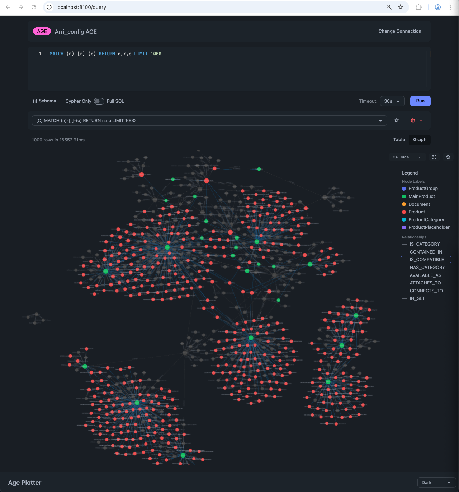

# Age Plotter

A modern web UI for querying Neo4j and PostgreSQL AGE graph databases. Built as a lightweight alternative to Neo4j Browser and AGViewer.



## Features

- **Monaco Editor** - VS Code's editor with Cypher syntax highlighting
- **Schema-aware completions** - autocomplete for node labels, relationship types, and properties
- **Graph visualization** - interactive Cytoscape.js graphs with multiple layout options
- **Dual view modes** - switch between table and graph views
- **Query history** - with favorites and draft auto-save
- **Multi-database support** - Neo4j (Bolt) and PostgreSQL AGE
- **Session isolation** - each browser session has independent connections

## Requirements

- Python 3.11+
- Node.js 18+
- [uv](https://github.com/astral-sh/uv) (recommended) or pip

## Quick Start

```bash
# Install dependencies
npm install
npm run build
uv sync

# Run
uv run python -m age_plotter
```

Open http://localhost:8100

## Docker

```bash
# Copy and edit connection config
cp connections.example.json connections.json

# Run with docker-compose
docker-compose up
```

## Configuration

Environment variables:

| Variable | Default | Description |
|----------|---------|-------------|
| `AGE_PLOTTER_HOST` | `127.0.0.1` | Host to bind |
| `AGE_PLOTTER_PORT` | `8100` | Port to bind |
| `AGE_PLOTTER_CONNECTIONS` | - | Path to JSON file with preconfigured connections |

### Preconfigured Connections

Create a `connections.json` file (see `connections.example.json`):

```json
[
  {
    "name": "Local Neo4j",
    "type": "neo4j",
    "uri": "bolt://localhost:7687",
    "username": "neo4j",
    "password": "password",
    "database": "neo4j"
  },
  {
    "name": "Local AGE",
    "type": "age",
    "host": "localhost",
    "port": 5432,
    "database": "mydb",
    "username": "postgres",
    "password": "password",
    "graph_name": "my_graph"
  }
]
```

Then:

```bash
export AGE_PLOTTER_CONNECTIONS=/path/to/connections.json
uv run python -m age_plotter
```

## Development

```bash
# Watch mode for frontend assets
npm run watch:css
npm run watch:js

# Run with auto-reload
uv run python -m age_plotter --reload
```

## License

MIT
